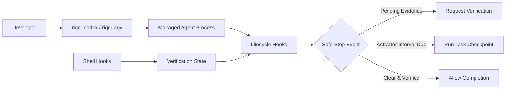

<div align="center">


# Riqor

> **Proof before done** — Local evidence gates and managed task checkpoints for AI coding sessions.

[](https://nodejs.org/)
[](https://www.npmjs.com/package/riqor)
[](#requirements)
[](LICENSE)

[Quick Start](#quick-start) · [Why Riqor](#why-riqor) · [Divio Docs](docs/README.md) · [CLI Reference](docs/CLI_REFERENCE.md) · [Security](docs/SECURITY_MODEL.md)

</div>

---

## What is Riqor?

AI coding agents often lose track of goals, repeat work, skip final test suites, or report completion from stale evidence. **Riqor** wraps local AI coding sessions (Codex and Google Antigravity) with local controls that keep completion claims tied to observable repository evidence.

Riqor runs entirely locally — no background daemons, no network listeners, and no modifications to model weights or remote conversation infrastructure. Hosted ChatGPT conversations do not execute local Riqor code.

---

## Why Riqor Exists

When an AI agent modifies your codebase, how do you verify that its completion claim is true?

| Control | What It Solves | How Riqor Does It |
| --- | --- | --- |
| **Evidence gate** | Agent claims task is "done" without running tests | Tracks workspace mutations and forces pending verification checks before completing |
| **Session activator** | Agent drifts from the goal or gets stuck in loops | Reviews task progress at safe lifecycle boundaries without interrupting active turns |
| **Install and rollback** | Clean install/uninstall without breaking user environment | Uses versioned payload directories, ownership checks, and clean `riqor uninstall` |

---

## Quick Start

### 1. Install Riqor

```bash
npx riqor@beta install
```

The Homebrew formula tracks the stable channel (`0.1.x`). The `0.2.0-beta.2` feature set is published through npm under the `beta` dist-tag.

### 2. Verify Your Environment

```bash
riqor doctor --json
```

### 3. Start a Managed Agent Session

For **Codex**:
```bash
riqor codex --activator
```

For **Google Antigravity (AGY)**:
```bash
riqor agy --activator
```

> **Tip**: Custom activator timing can be specified via duration flags (e.g., `--activator-interval 15m --activator-watchdog 3m`).

---

## Documentation (Divio System)

Our documentation is structured according to the **Divio Documentation System**:

```text
                                DOCUMENTATION MATRIX

                 Learning-Oriented            Task-Oriented
             ┌────────────────────────┐  ┌────────────────────────┐
             │       TUTORIALS        │  │      HOW-TO GUIDES     │
   Practical │  Hands-on 0-to-1 steps │  │   Real-world recipes   │
             │  for new developers    │  │   & problem solving    │
             └────────────────────────┘  └────────────────────────┘
             ┌────────────────────────┐  ┌────────────────────────┐
             │       REFERENCE        │  │      EXPLANATION       │
 Theoretical │  Complete CLI, schema  │  │ Architecture, security │
             │  & skills specs        │  │ & evidence theory      │
             └────────────────────────┘  └────────────────────────┘
                 Information-Oriented        Understanding-Oriented
```

### 📘 [Tutorials (Learning)](docs/README.md#tutorials-learning-oriented)
- [Quick Start Tutorial](docs/tutorials/quick-start-tutorial.md) — Get up and running with Riqor in 10 minutes.
- [First Evidence Loop Tutorial](docs/tutorials/first-evidence-loop-tutorial.md) — Guided tour of workspace mutations and verification gates.

### 🛠️ [How-To Guides (Tasks)](docs/README.md#how-to-guides-task-oriented)
- [Set Up Activator Checkpoints](docs/how-to/setup-activator-checkpoints.md) — Configure periodic session checkpoints.
- [Configure Evidence Gates](docs/how-to/configure-evidence-gates.md) — Customize test tracking and mutation rules.
- [CI/CD & Automation Integration](docs/how-to/integrate-ci-cd-and-automation.md) — Workflows for GitHub Actions and security scanning.
- [Troubleshooting & Recovery Recipes](docs/how-to/troubleshoot-riqor-issues.md) — Diagnose and resolve local environment issues.

### 📑 [Reference (Information)](docs/README.md#reference-information-oriented)
- [CLI Reference](docs/CLI_REFERENCE.md) (or [Detailed Spec](docs/reference/cli-reference.md)) — Detailed spec of all `riqor` commands, options, and JSON outputs.
- [Agent Skills Pack Catalog](docs/reference/skills-pack-reference.md) — Complete inventory of canonical agent skills.
- [Schema & State Reference](docs/reference/schema-and-state-reference.md) — XDG directories, JSON file formats, and trace events.

### 💡 [Explanation (Understanding)](docs/README.md#explanation-understanding-oriented)
- [Architecture Overview](docs/explanation/architecture-overview.md) — Deep dive into system design and process boundaries.
- [Security & Trust Model](docs/SECURITY_MODEL.md) (or [Conceptual Deep Dive](docs/explanation/security-and-trust-model.md)) — Data boundary, zero-credential retention, and safety controls.
- [Evidence Gate Lifecycle](docs/explanation/evidence-gate-lifecycle.md) — The theoretical foundation behind evidence-based completion claims.

---

## Requirements

- **OS**: macOS or Linux
- **Node.js**: `22.x` or newer
- **Agent CLIs**: Codex CLI (`codex`) or Google Antigravity CLI (`agy` / `antigravity`)
- **Shell**: Python 3 (for managed shell integration) and `zsh` or `bash`
- **Development**: Bun `1.3.14` (required for repository building and testing)

---

## How It Works



---

## Command Summary

| Command | Category | Purpose |
| --- | --- | --- |
| `riqor install` | Setup | Install versioned binary payload and local shell hooks |
| `riqor doctor` | Diagnostics | Run integrity, provenance, and environment health checks |
| `riqor status` | Diagnostics | Display version and active integration surfaces |
| `riqor codex --activator` | Execution | Launch a managed Codex session with periodic checkpoints |
| `riqor agy --activator` | Execution | Launch a managed Antigravity (AGY) session with periodic checkpoints |
| `riqor run start` | Assurance | Create a repository-scoped run bound to a goal |
| `riqor run complete` | Assurance | Complete an active run if verification is clear |
| `riqor terminal status` | Evidence | Inspect evidence status (`clear` or `verification-pending`) |
| `riqor uninstall` | Cleanup | Safely remove managed shims and version directories |

---

## Contributing & Development

Contributions are welcome! Please see [CONTRIBUTING.md](CONTRIBUTING.md) for contribution rules and development setup.

To run the repository verification suite:
```bash
bun install --frozen-lockfile
bun test
bun run plugin:health
bun run skills:health
bun run riqor:pack
bun run riqor:test
```

---

## License

Riqor is open-source software licensed under the [MIT License](LICENSE).
