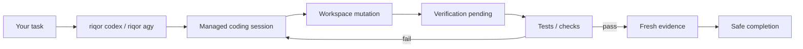

<div align="center">


# Riqor

### Coding agents can say done. Riqor asks for proof

Local evidence gates, session checkpoints, and repository-scoped traces for AI coding work

[](https://www.npmjs.com/package/riqor)
[](https://nodejs.org/)
[](packages/riqor/package.json)
[](LICENSE)

[Install](#quick-start) · [Codex Plugin](#codex-plugin) · [How it works](#how-it-works) · [Docs](docs/README.md) · [Security](docs/SECURITY_MODEL.md)

</div>

## Proof before done

AI coding sessions can drift from the original goal, change code after the last test run, or finish with a confident summary that is no longer supported by the repository state

Riqor adds local controls around that workflow

- **Evidence gate** tracks successful workspace mutations and requires fresh verification before completion
- **Session activator** revisits the goal at safe lifecycle boundaries during long Codex or Antigravity sessions
- **Run trace** records bounded, repository-scoped evidence without storing source code, prompts, or command output
- **Safe install and rollback** uses versioned payloads and ownership checks instead of replacing unrelated local tooling

Riqor runs locally. Hosted ChatGPT conversations do not execute local Riqor code

## Quick start

```bash
npx riqor install
riqor doctor --json
riqor codex --activator
```

Or install the CLI globally

```bash
npm install -g riqor
```

Node.js 22+ is required. Bun is only used to develop and test this repository, not to run the published package

## Codex Plugin

Riqor also ships through the ChatGPT/Codex Plugin Directory as a portable specialist capability pack with lifecycle hooks

```bash
codex plugin marketplace add imMamdouhaboammar/riqor --ref main
codex plugin add riqor@riqor
```

One plugin installation exposes **100 public specialist Skills** to ChatGPT and Codex. The distributed plugin bundles the same 100 roles as native Codex agents, and every bundled native agent is required to load its paired Skill before task execution. `riqor install` registers the native agents in an isolated `riqor` Codex profile, while the plugin itself remains Skills + lifecycle hooks only: no apps, MCP servers, or tool configuration

The npm package provides the local CLI and runtime used by commands such as `riqor doctor`, `riqor run`, and `riqor codex`

The public specialist catalog is generated deterministically from the canonical agent definitions after applying the explicit public-plugin safety exclusion list. `riqor-core` includes a generated specialist index so a general Riqor request can route to the closest Skill instead of loading the whole catalog at once

The plugin also includes `chatgpt-codex-plugin-autopilot`, a repo-agnostic operational Skill for current-contract inspection, public-distribution safety review, deterministic validation/packaging, submission diagnosis, and gated release publication

## What Riqor watches

| During a coding session | Riqor response |
| --- | --- |
| A tool successfully changes the workspace | Marks verification as pending |
| A recognized check passes after the latest change | Clears the pending evidence state |
| Codex reaches a safe Stop boundary with stale evidence | Requests verification before completion |
| A managed session reaches its checkpoint interval | Reviews goal, progress, and current evidence |
| A later mutation happens after a passing check | Invalidates that earlier completion evidence |

Riqor does not decide whether your implementation is good. It makes the evidence behind a completion claim visible and current

## How it works



For long sessions, the optional activator runs only at a safe lifecycle boundary. It does not inject a checkpoint into an active turn

## A repository run in 30 seconds

```bash
riqor run start \
  --goal "Fix the parser regression and prove it" \
  --path evidence-loop \
  --profile assured

riqor run status --json
riqor trace show <run-id> --json
riqor run complete --json
```

A run gives one task an explicit goal, ordered evidence events, and a completion boundary tied to the current repository state

## Local by design

Riqor does not install a network listener and does not need a hosted Riqor account

Riqor also keeps an optional offline adoption ledger for the local runtime. It records coarse local counters only, never sends them to a Riqor server, and reports public ChatGPT Marketplace install counts as `unknown` rather than inventing a number

```bash
riqor adoption
riqor adoption --json
riqor adoption --export ./riqor-adoption-receipt.json
riqor adoption --reset
```

Persisted run and activator state intentionally excludes

- prompts and transcripts
- source file contents
- raw commands and command output
- environment values
- credentials, cookies, and tokens

See the [Security Model](docs/SECURITY_MODEL.md) for filesystem, process, plugin, and state boundaries

## Core commands

| Command | Purpose |
| --- | --- |
| `riqor install` | Install the versioned local runtime and managed integrations |
| `riqor doctor` | Check package integrity and local environment health |
| `riqor status` | Show installed versions and active surfaces |
| `riqor codex --activator` | Start a managed Codex session with checkpoints |
| `riqor agy --activator` | Start a managed Antigravity session with checkpoints |
| `riqor run start` | Start a repository-scoped evidence run |
| `riqor run status` | Inspect the active run and verification state |
| `riqor trace show` | Inspect ordered evidence events |
| `riqor run complete` | Complete a run only when verification is clear |
| `riqor uninstall` | Remove only Riqor-managed local changes |

Full command details live in the [CLI Reference](docs/CLI_REFERENCE.md)

## Release evidence

Every release is checked against repository tests, packaged runtime tests, plugin validation, tarball inspection, action pinning, and security checks before publication

Release-specific evidence is stored under [`docs/releases/`](docs/releases/)

## Documentation

- [Getting Started](docs/GETTING_STARTED.md)
- [CLI Reference](docs/CLI_REFERENCE.md)
- [Architecture](docs/ARCHITECTURE.md)
- [Agent Skills](docs/AGENT_SKILLS.md)
- [Security Model](docs/SECURITY_MODEL.md)
- [Troubleshooting](docs/TROUBLESHOOTING.md)

## Development

```bash
bun install --frozen-lockfile
bun test
bun run plugin:health
bun run skills:health
bun run riqor:test
```

See [CONTRIBUTING.md](CONTRIBUTING.md) before opening a pull request

## License

MIT
