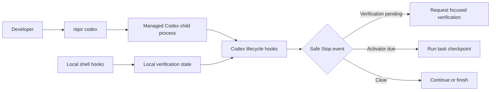

<div align="center">

# Riqor

**Proof before done**

Local evidence gates and managed checkpoints for Codex sessions

[](https://nodejs.org/)
[](#requirements)
[](LICENSE)

[Quick start](#quick-start) · [How it works](#how-riqor-works) · [Commands](#command-overview) · [Documentation](docs/README.md) · [Security](SECURITY.md)

</div>

Riqor wraps local AI coding sessions with checks that keep completion claims tied to observable evidence. It records when a successful command changed the workspace, asks for focused verification before completion, and can run periodic task checkpoints inside Codex sessions launched through Riqor.

Riqor does not modify the model, read hosted ChatGPT conversations, or attach to unrelated Codex processes.

## Why Riqor

Coding agents can lose the task goal, repeat work, skip a final test, or report completion from stale evidence. Riqor adds three local controls around that workflow:

| Control | What it does |
| --- | --- |
| Evidence gate | Tracks successful workspace mutations and keeps verification pending until relevant checks are run |
| Session activator | Reviews the task, progress, evidence, and scope at a safe Codex lifecycle point after a chosen interval |
| Install and rollback | Installs versioned local payloads and shell shims, then removes managed changes with `riqor uninstall` |

## Quick Start

### 1. Install

```bash
npx riqor install
```

Homebrew is also supported:

```bash
brew install imMamdouhaboammar/tap/riqor
riqor install
```

### 2. Check the environment

```bash
riqor status --json
riqor doctor --json
```

### 3. Start a managed Codex session

```bash
riqor codex --activator
```

The default activator interval is 15 minutes with a 3-minute watchdog window.

```bash
riqor codex --activator \
  --activator-interval 15m \
  --activator-watchdog 3m
```

Codex arguments can follow the Riqor options:

```bash
riqor codex --activator --help
```

## Requirements

- macOS or Linux
- Node.js 22 or newer
- Codex CLI installed and authenticated for Codex features
- Python 3 for managed shell integration
- Bun 1.3.14 for repository development and verification
- Kaku for a fully green current full-doctor report; direct `riqor codex` use does not require launching Kaku

## What a Managed Checkpoint Reviews

When the interval is due, Riqor waits for the next safe Codex `Stop` event. It does not interrupt an active turn. The checkpoint asks Codex to:

1. Restate the current task and observable success criteria
2. Inspect relevant status, diffs, tests, and recent results
3. Summarize completed work without claiming unfinished work
4. Detect scope drift, repeated work, stale assumptions, and missing checks
5. Continue with the smallest relevant correction

The watchdog limits one checkpoint cycle and prevents repeated Stop loops. It does not terminate the main Codex process.

## How Riqor Works



Riqor uses local lifecycle hooks and local state. Activator state is scoped to a random token created for the current `riqor codex` child process. Closing that process ends the activator. No daemon or network listener is installed.

## Command Overview

| Command | Purpose |
| --- | --- |
| `riqor install` | Install the versioned runtime, safe shims, shell integration, and bundled Codex plugin when Codex is available |
| `riqor uninstall` | Remove Riqor-owned files while preserving unrelated local paths |
| `riqor status` | Show the installed version and detected integrations |
| `riqor doctor` | Check package health, platform support, Codex, and current Kaku integration |
| `riqor version` | Print Riqor and plugin versions |
| `riqor codex [args]` | Start Codex with the Riqor environment |
| `riqor codex --activator` | Start a managed Codex session with periodic checkpoints |
| `riqor terminal status` | Show `clear` or `verification-pending` for the current terminal session |
| `riqor paths list` | List available reviewed workflow paths |
| `riqor plugin status` | Show Codex plugin installation state |
| `riqor shell status` | Show local shell integration state |

Use `--json` with status and diagnostic commands when machine-readable output is needed. See the [CLI reference](docs/CLI_REFERENCE.md) for every command, option, bound, and exit behavior.

## What Riqor Changes Locally

The package installer uses XDG paths when configured and otherwise writes to these locations:

```text
~/.local/share/riqor/       versioned package payloads and current symlink
~/.config/riqor/            install manifest and managed configuration
~/.local/state/riqor/       installer state
~/.local/bin/riqor          executable shim
~/.local/bin/codex-harness  compatibility alias
~/.local/bin/cxh            compatibility alias
```

Shell integration may also create managed Kaku and zsh files with backups. The installer refuses unrelated executable paths instead of overwriting them, and uninstall preserves any path that does not carry a Riqor or recognized legacy ownership marker. Run `riqor uninstall` to remove Riqor-managed changes.

## Security Boundaries

- Riqor runs locally and does not expose a network service
- Packaged runtime files are checked against SHA-256 provenance before package diagnostics pass
- Installer and uninstaller ownership checks preserve unrelated command paths
- Activator values are bounded before use
- Codex is launched with argument arrays and `shell: false`
- Managed activator sessions use random tokens and hashed state filenames
- Activator state does not retain prompts, transcripts, commands, source contents, or credentials
- The activator never discovers or attaches to external Codex sessions
- Hosted ChatGPT conversations do not execute local Riqor code
- High-risk or durable learning actions remain subject to explicit approval

Read the [security model](docs/SECURITY_MODEL.md) for trust boundaries and state handling. Report vulnerabilities through [GitHub Private Vulnerability Reporting](https://github.com/imMamdouhaboammar/riqor/security/advisories/new).

## Documentation

- [Documentation index](docs/README.md)
- [Getting started](docs/GETTING_STARTED.md)
- [CLI reference](docs/CLI_REFERENCE.md)
- [Architecture](docs/ARCHITECTURE.md)
- [Security model](docs/SECURITY_MODEL.md)
- [Troubleshooting](docs/TROUBLESHOOTING.md)
- [Releasing](docs/RELEASING.md)
- [Contributing](CONTRIBUTING.md)
- [Changelog](CHANGELOG.md)

## Development

```bash
bun install --frozen-lockfile
bun test
bun run plugin:health
bun run skills:health
bun run riqor:pack
bun run riqor:inspect -- packages/riqor/riqor-*.tgz
bun run riqor:test
bun run actions:verify
```

Run the complete command set before submitting repository changes.

## License

Riqor is released under the [MIT License](LICENSE).
