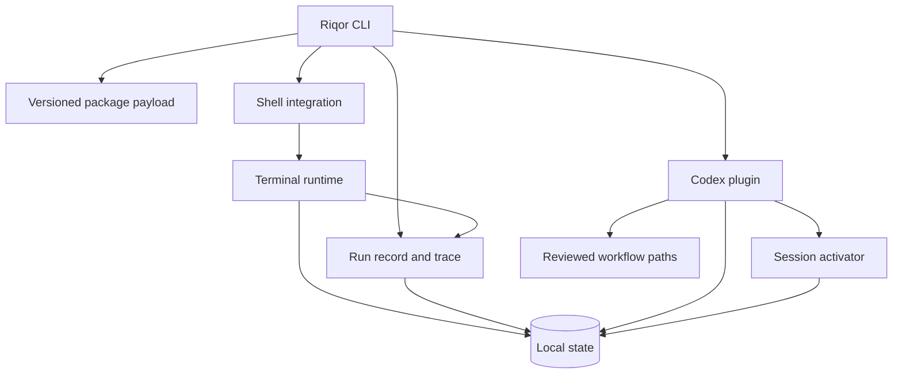
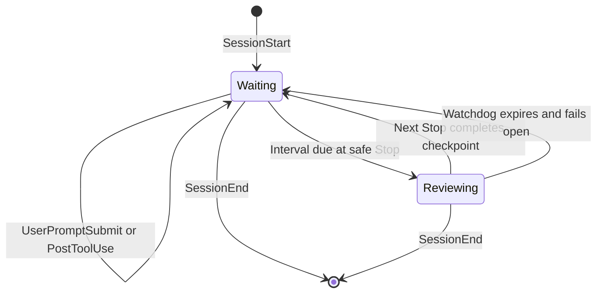
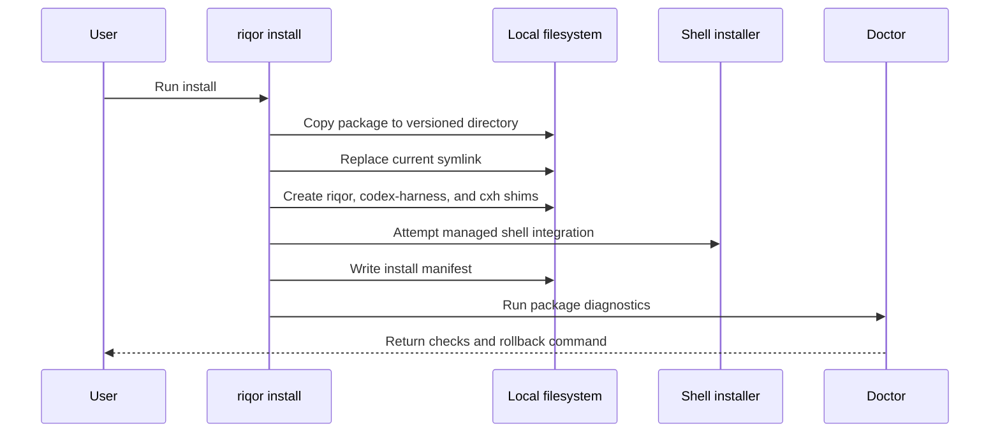
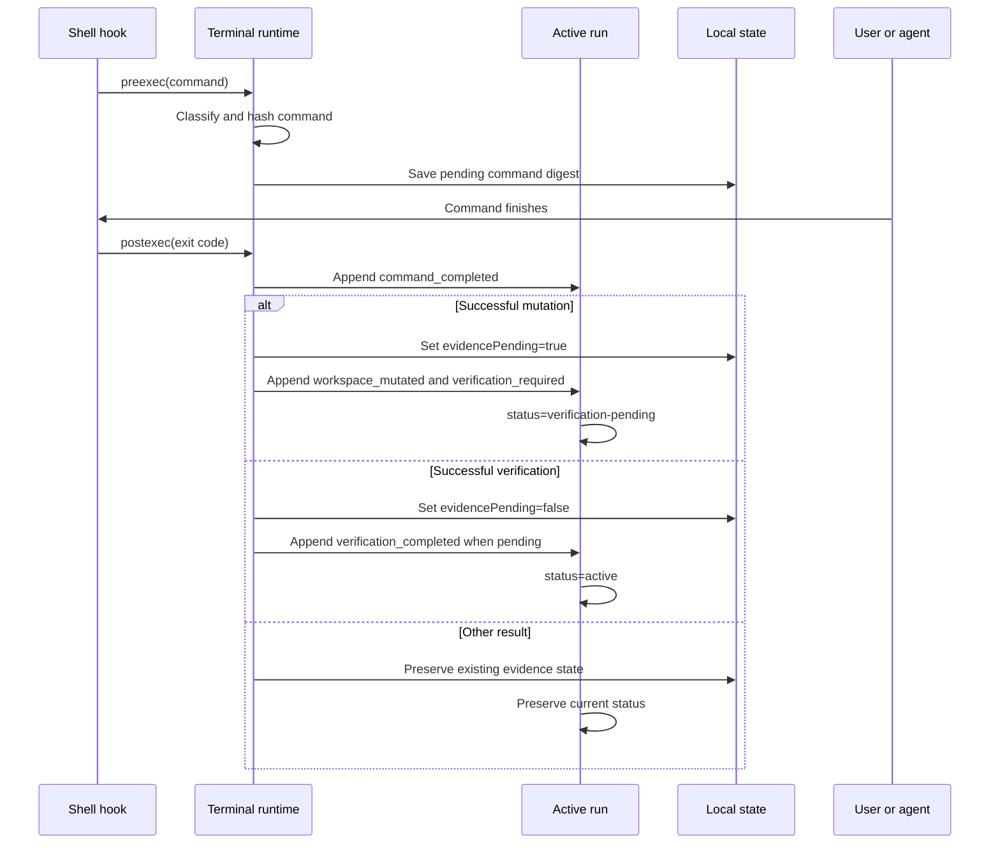

# Architecture

Riqor is a local runtime around AI coding sessions. It combines a packaged CLI, shell hooks, Codex lifecycle hooks, reviewed workflow paths, repository-scoped run records, and local state.

## Design Goals

- Keep completion claims tied to observable repository evidence
- Record bounded run history without retaining prompts or raw commands
- Add checkpoints without interrupting active Codex turns
- Scope activator behavior to sessions started through Riqor
- Avoid background daemons and network listeners
- Keep installation versioned and removable
- Preserve the current Codex approval policy and argument handling

## Component Map



## Main Components

### Packaged CLI

The npm package under `packages/riqor/` exposes three command names:

- `riqor`
- `codex-harness`
- `cxh`

`riqor` is the primary name. The other names are compatibility aliases.

The package CLI owns package installation, package diagnostics, status, version reporting, uninstall behavior, repository runs, and trace inspection. Commands not handled at the package layer are passed to the bundled harness CLI.

### Versioned Payload Installer

`riqor install` copies the package into a version-specific data directory, updates a `current` symlink, creates executable shims, attempts shell integration, and writes an install manifest.

The versioned layout allows an installation to point to one complete payload instead of modifying files inside a shared package directory.

### Shell Integration

Shell hooks call the terminal runtime before and after commands. The runtime classifies the command as:

- `mutation`
- `verification`
- `agent`
- `other`

A mutation-classified command sets `evidencePending` to `true`, regardless of its final exit code, because earlier operations may already have changed the workspace. A successful recognized verification command clears it. Failed verification and unrelated commands preserve existing evidence state.

Command text is reduced to a SHA-256 digest in terminal state. The stored state includes classification, exit status, route, timing, and the pending evidence flag.

### Run Record and Trace

The assurance code under `src/assurance/` adds one active run pointer per repository identity.

A run contains:

- explicit user-supplied goal
- existing workflow path identifier
- `standard` or `assured` execution profile
- current status
- repository root digest
- current Git HEAD when available
- dirty boolean
- next event sequence
- creation, update, and completion timestamps

The store in `src/assurance/run-store.ts` writes:

```text
${RIQOR_STATE_HOME:-${XDG_STATE_HOME:-~/.local/state}/riqor}/
  projects/<repository-root-digest>/
    active.json
    runs/<run-id>/
      run.json
      events.jsonl
      .lock
```

`run.json` is replaced atomically. `events.jsonl` is append-only and ordered by a monotonically increasing sequence allocated while holding the per-run lock.

Initial event types are:

```text
run_started
command_completed
workspace_mutated
verification_required
verification_completed
run_completed
```

The initial run lifecycle is:

```mermaid
stateDiagram-v2
    [*] --> active: riqor run start
    active --> verification-pending: mutation-classified command
    verification-pending --> verification-pending: failed or unrelated command
    verification-pending --> active: successful recognized verification
    active --> completed: riqor run complete
    completed --> [*]
```

`riqor run complete` rejects a run in `verification-pending`. A successful completion appends `run_completed`, stores `completedAt`, and removes the repository's active pointer.

### Repository Identity

`src/assurance/repository-identity.ts` resolves the canonical Git root when available and falls back to the canonical current directory outside Git.

Only these repository fields are persisted:

- SHA-256 digest of the canonical root
- Git HEAD or `null`
- dirty boolean

The raw canonical path exists only in process memory so the state directory can be selected. It is not written to the run record or event stream.

### Codex Plugin

The Codex plugin responds to lifecycle events and applies the reviewed workflow rules. At a safe `Stop` event, the evidence gate runs before the optional activator checkpoint. A pending mutation remains blocked across ordinary and active-continuation `Stop` events until a recognized, successful check covers it. Active-continuation handling suppresses only recursive activator checkpoints; it cannot bypass the evidence gate.

The plugin is installed into the local Codex environment. Codex App and Codex CLI can share that plugin through the local `CODEX_HOME` configuration.

### Session Activator

The activator is enabled only when Codex is started with:

```bash
riqor codex --activator
```

The wrapper creates a random session token and exports bounded timing values to the child process. The plugin ignores activator behavior when the required environment values are absent or invalid.

The activator lifecycle is:



The checkpoint waits for a safe Codex lifecycle boundary. It does not inject terminal input or start a second writer for the same session.

### Reviewed Workflow Paths

The plugin includes curated paths that define:

- objective
- relevant skills
- required evidence
- guardrails
- explicit approval requirements

List the public path metadata with:

```bash
riqor paths list --json
```

An execution profile is independent from the selected path. For example, `secure-change` can run with the `assured` profile without creating a duplicate path.

## Installation Flow



## Terminal Evidence Flow



When the current repository has no active run, terminal verification tracking continues to work as before and no run event is appended.

## Activator Stop Flow

At each eligible Codex `Stop` event:

1. The plugin evaluates the existing evidence gate
2. If evidence is pending, verification keeps precedence
3. If evidence is clear and the activator interval is due, one checkpoint begins
4. The next Stop completes the cycle and schedules the next interval
5. If the review phase exceeds the watchdog, Riqor resets the cycle and allows progress

## Local Paths

Riqor respects XDG environment variables when present.

| Purpose | XDG-aware default |
| --- | --- |
| Versioned package data | `${XDG_DATA_HOME:-~/.local/share}/riqor/` |
| Active payload symlink | `${XDG_DATA_HOME:-~/.local/share}/riqor/current` |
| Configuration | `${XDG_CONFIG_HOME:-~/.config}/riqor/` |
| Run records and installer state | `${XDG_STATE_HOME:-~/.local/state}/riqor/` |
| Executable shims | `~/.local/bin/` |

Run storage can be overridden with `RIQOR_STATE_HOME`.

Terminal verification state defaults to:

```text
~/.local/state/codex-self-improvement/
```

It can be changed with `CODEX_SELF_IMPROVEMENT_DATA`.

Activator state is stored below the plugin data directory under `activator/`.

## State Handling

Run and terminal state use:

- SHA-256 repository, session, and command digests
- JSON records and ordered JSONL events
- mode `0700` for state directories
- mode `0600` for state files
- temporary files followed by atomic rename for mutable JSON
- exclusive run locks
- stale lock recovery
- malformed schema rejection
- symlink rejection

Activator state additionally uses:

- random UUID session tokens
- hashed filenames
- bounded state size and state count
- per-session locks
- stale record pruning

See [Security Model](SECURITY_MODEL.md) for trust boundaries and failure behavior.

## Failure Behavior

- Invalid run goals, paths, profiles, and run identifiers fail before state mutation
- A second active run is rejected
- Corrupt or unknown state schemas fail closed
- Repository identity mismatches are rejected
- A live run lock times out with an explicit busy error
- A stale regular lock is recovered after the configured bound
- A run with pending verification cannot complete
- Invalid activator options fail before Codex starts
- Invalid inherited activator values are ignored
- The watchdog fails open after a bounded checkpoint cycle
- `riqor doctor` returns a non-zero status when required checks fail
- External Codex doctor findings are reported separately from core checks
- Uninstall is the documented rollback path for managed local changes

## Hosted Conversation Boundary

Riqor does not run inside a hosted ChatGPT conversation. A ChatGPT-controlled local terminal may inherit Riqor through the local shell environment, but the remote conversation runtime does not execute the local package or access its state directly.

## Source Guide

| Area | Source path |
| --- | --- |
| Packaged CLI | `packages/riqor/src/cli.ts` |
| Package install | `packages/riqor/src/commands/install.ts` |
| Package diagnostics | `packages/riqor/src/commands/doctor.ts` |
| User paths | `packages/riqor/src/paths.ts` |
| Harness CLI and Codex wrapper | `src/harness-cli.ts` |
| Assurance command routing | `src/assurance/cli.ts` |
| Repository identity | `src/assurance/repository-identity.ts` |
| Run and trace store | `src/assurance/run-store.ts` |
| Terminal to run mapping | `src/assurance/terminal-trace.ts` |
| Terminal state | `src/terminal-runtime.ts` |
| Codex hooks | `plugins/riqor/hooks/` |
| Activator state | `plugins/riqor/hooks/activator.ts` |
| Workflow paths | `plugins/riqor/hooks/paths.ts` |
| Package tests | `packages/riqor/test/` |
| Integration tests | `test/` |
