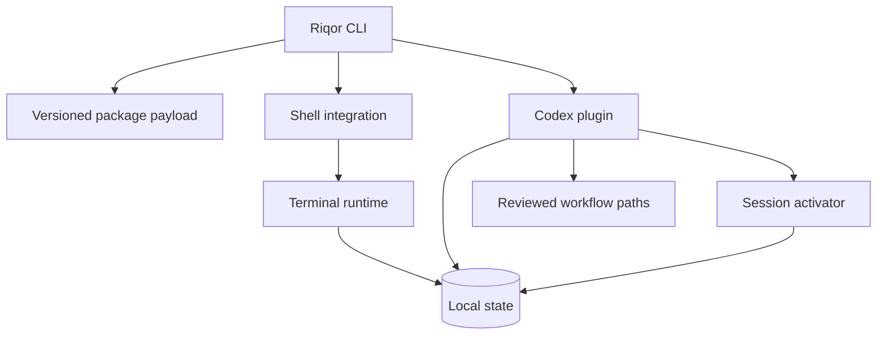
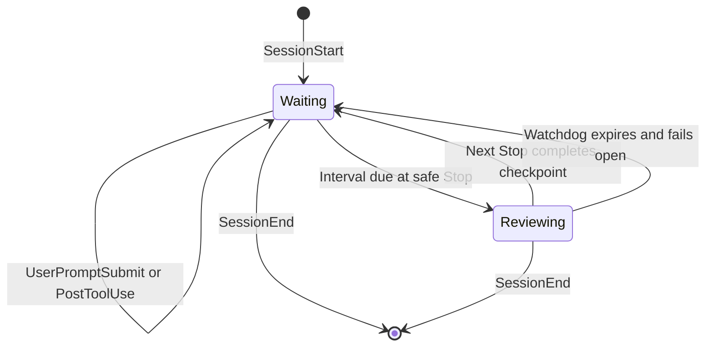
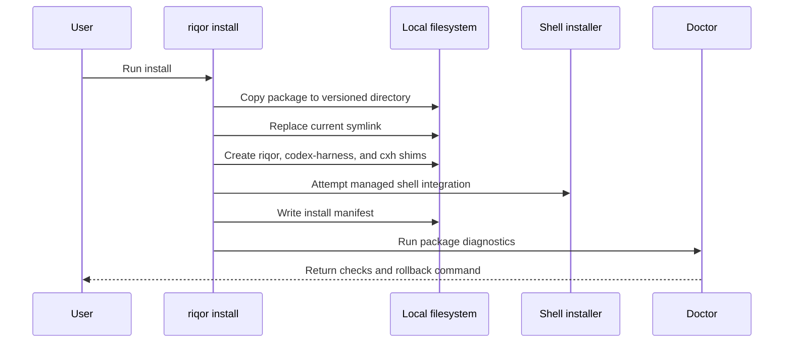
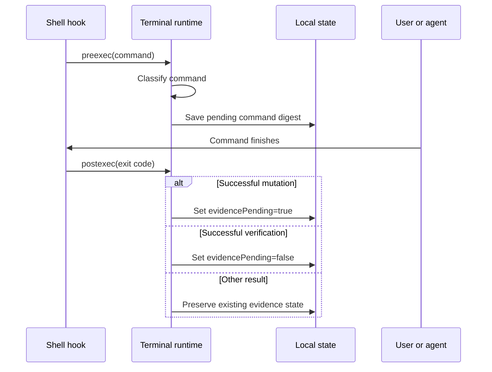

# Architecture

Riqor is a local runtime around AI coding sessions. It combines a packaged CLI, shell hooks, Codex lifecycle hooks, reviewed workflow paths, and local state.

## Design Goals

- Keep completion claims tied to observable repository evidence
- Add checkpoints without interrupting active Codex turns
- Scope activator behavior to sessions started through Riqor
- Avoid background daemons and network listeners
- Keep installation versioned and removable
- Preserve the current Codex approval policy and argument handling

## Component Map



## Main Components

### Packaged CLI

The npm package under `packages/riqor/` exposes three command names:

- `riqor`
- `codex-harness`
- `cxh`

`riqor` is the primary name. The other names are compatibility aliases.

The package CLI owns package installation, package diagnostics, status, version reporting, and uninstall behavior. Commands not handled at that layer are passed to the bundled harness CLI.

### Versioned Payload Installer

`riqor install` copies the package into a version-specific data directory, updates a `current` symlink, creates executable shims, attempts shell integration, and writes an install manifest.

The versioned layout allows an installation to point to one complete payload instead of modifying files inside a shared package directory.

### Shell Integration

Shell hooks call the terminal runtime before and after commands. The runtime classifies the command as:

- `mutation`
- `verification`
- `agent`
- `other`

A successful mutation keeps `evidencePending` set to `true`. A successful recognized verification command clears it. Failed commands do not clear existing pending evidence.

Command text is reduced to a SHA-256 digest in terminal state. The stored state includes classification, exit status, route, timing, and the pending evidence flag.

### Codex Plugin

The Codex plugin responds to lifecycle events and applies the reviewed workflow rules. At a safe `Stop` event, the existing evidence gate runs before the optional activator checkpoint.

The plugin is installed into the local Codex environment. Codex App and Codex CLI can share that plugin through the local `CODEX_HOME` configuration.

### Session Activator

The activator is enabled only when Codex is started with:

```bash
riqor codex --activator
```

The wrapper creates a random session token and exports bounded timing values to the child process. The plugin ignores activator behavior when the required environment values are absent or invalid.

The activator lifecycle is:



The checkpoint waits for a safe Codex lifecycle boundary. It does not inject terminal input or start a second writer for the same session.

### Reviewed Workflow Paths

The plugin includes curated paths that define:

- objective
- relevant skills
- required evidence
- guardrails
- explicit approval requirements

List the public path metadata with:

```bash
riqor paths list --json
```

## Installation Flow



## Terminal Evidence Flow



## Activator Stop Flow

At each eligible Codex `Stop` event:

1. The plugin evaluates the existing evidence gate
2. If evidence is pending, verification keeps precedence
3. If evidence is clear and the activator interval is due, one checkpoint begins
4. The next Stop completes the cycle and schedules the next interval
5. If the review phase exceeds the watchdog, Riqor resets the cycle and allows progress

## Local Paths

Riqor respects XDG environment variables when present.

| Purpose | XDG-aware default |
| --- | --- |
| Versioned package data | `${XDG_DATA_HOME:-~/.local/share}/riqor/` |
| Active payload symlink | `${XDG_DATA_HOME:-~/.local/share}/riqor/current` |
| Configuration | `${XDG_CONFIG_HOME:-~/.config}/riqor/` |
| Installer state | `${XDG_STATE_HOME:-~/.local/state}/riqor/` |
| Executable shims | `~/.local/bin/` |

Terminal verification state defaults to:

```text
~/.local/state/codex-self-improvement/
```

It can be changed with `CODEX_SELF_IMPROVEMENT_DATA`.

Activator state is stored below the plugin data directory under `activator/`.

## State Handling

Terminal state uses:

- SHA-256 session and command digests
- JSON records
- mode `0700` for the state directory
- mode `0600` for state files
- temporary files followed by atomic rename

Activator state adds:

- random UUID session tokens
- hashed filenames
- bounded state size and state count
- restrictive permissions
- per-session locks
- stale lock handling
- malformed state rejection
- symlink rejection
- stale record pruning

See [Security Model](SECURITY_MODEL.md) for trust boundaries and failure behavior.

## Failure Behavior

- Invalid activator options fail before Codex starts
- Invalid inherited activator values are ignored
- The watchdog fails open after a bounded checkpoint cycle
- `riqor doctor` returns a non-zero status when required checks fail
- External Codex doctor findings are reported separately from core checks
- Uninstall is the documented rollback path for managed local changes

## Hosted Conversation Boundary

Riqor does not run inside a hosted ChatGPT conversation. A ChatGPT-controlled local terminal may inherit Riqor through the local shell environment, but the remote conversation runtime does not execute the local package or access its state directly.

## Source Guide

| Area | Source path |
| --- | --- |
| Packaged CLI | `packages/riqor/src/cli.ts` |
| Package install | `packages/riqor/src/commands/install.ts` |
| Package diagnostics | `packages/riqor/src/commands/doctor.ts` |
| User paths | `packages/riqor/src/paths.ts` |
| Harness CLI and Codex wrapper | `src/harness-cli.ts` |
| Terminal state | `src/terminal-runtime.ts` |
| Codex hooks | `plugins/codex-self-improvement/hooks/` |
| Activator state | `plugins/codex-self-improvement/hooks/activator.ts` |
| Workflow paths | `plugins/codex-self-improvement/hooks/paths.ts` |
| Package tests | `packages/riqor/test/` |
| Integration tests | `test/` |
