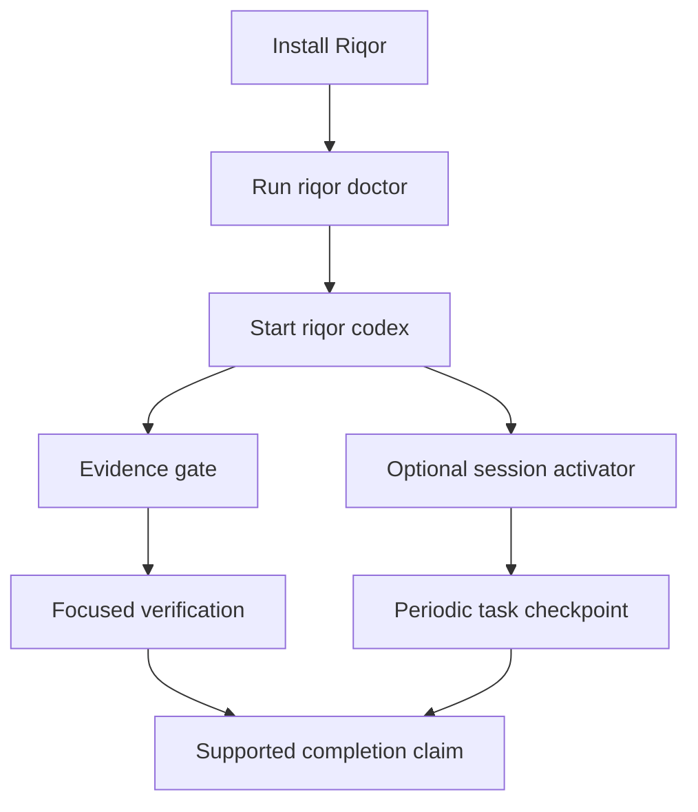

# Riqor Documentation

Use this page to move from installation to implementation details without searching through source files.

## Start Here

| Goal | Guide |
| --- | --- |
| Install and run Riqor | [Getting Started](GETTING_STARTED.md) |
| Find a command or flag | [CLI Reference](CLI_REFERENCE.md) |
| Understand components and data flow | [Architecture](ARCHITECTURE.md) |
| Review trust boundaries and local state | [Security Model](SECURITY_MODEL.md) |
| Diagnose an installation or session problem | [Troubleshooting](TROUBLESHOOTING.md) |
| Contribute code or documentation | [Contributing](../CONTRIBUTING.md) |
| Review release history | [Changelog](../CHANGELOG.md) |

## Product Map

## Core Concepts

### Evidence pending

A terminal session becomes `verification-pending` after a successful command classified as a workspace mutation. The state is a reminder that a relevant check should run before completion is claimed.

### Managed Codex session

A managed session is a Codex child process started through `riqor codex`. Riqor sets the local environment required by its Codex hooks for that child.

### Session activator

The activator is opt-in through `riqor codex --activator`. It waits until a configured interval has passed, then uses the next safe Codex `Stop` event for one bounded task checkpoint.

### Watchdog

The activator watchdog limits a checkpoint cycle. If the review phase exceeds the deadline, Riqor resets the cycle and allows the session to continue. It is not a process timeout.

### Reviewed workflow paths

Riqor includes curated workflow paths with objectives, evidence requirements, guardrails, relevant skills, and approval requirements. List them with `riqor paths list`.

## Scope Notes

Riqor is local software. It can affect Codex App, Codex CLI, Kaku, and terminal sessions only through installed local hooks, shims, and inherited environment values. Hosted ChatGPT conversations do not run Riqor inside the remote conversation runtime.

## Repository Documents

The `docs/superpowers/` directory contains implementation specifications and plans used during feature development. Those files record design decisions and implementation history. The guides linked above are the public operating documentation.
