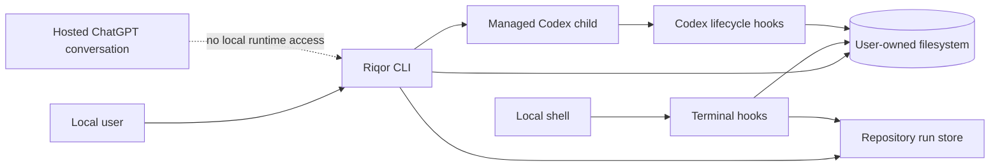

# Security Model

This document describes the local trust boundaries, protected data, failure behavior, and non-goals of Riqor. Vulnerability reporting instructions remain in the repository [Security Policy](../SECURITY.md).

## Scope

Riqor is local developer tooling. It installs local files, launches Codex child processes, participates in local shell and Codex lifecycle hooks, and stores bounded local state.

Riqor does not expose a network listener and does not run inside hosted ChatGPT conversation infrastructure.

## Protected Assets

Riqor is designed to avoid unnecessary retention of:

- prompts
- conversation transcripts
- source contents
- raw command text
- command output
- environment values
- credentials and access tokens
- cookies and private keys
- external Codex session identifiers
- raw canonical repository paths in run records

Riqor still runs in the user's local environment. Any process with the same user permissions may be able to inspect process memory or local files while they are in use. Riqor does not claim isolation from a compromised user account or operating system.

## Trust Boundaries



### Trusted inputs

Riqor treats these as user-controlled local configuration:

- command-line options supplied to `riqor`
- XDG path environment values
- `RIQOR_STATE_HOME`
- `CODEX_SELF_IMPROVEMENT_DATA`
- the installed package payload
- the current local Codex and shell configuration

### Untrusted or bounded inputs

Run goals, run identifiers, parent references, event metadata, inherited environment values, and stored state are validated before use.

Run goals are explicit CLI input, limited to 2,000 characters, normalized, and rejected when empty or when they contain unsupported control characters.

The activator treats inherited environment values as untrusted until they pass validation. Timing values and session tokens must match strict formats and bounds.

Stored run, trace, terminal, and activator files are validated before use. Malformed records, unknown schema versions, unexpected file types, and symlink replacements are rejected or ignored according to the relevant operation.

## Repository Run Boundary

A run is scoped to the SHA-256 digest of the canonical repository root. The persisted repository identity contains only:

- root digest
- Git HEAD when available
- dirty boolean

The canonical path is used in process memory to select the project state directory and is not written to `run.json` or `events.jsonl`.

A repository has at most one active run pointer. Explicit run identifiers are resolved only below the current repository digest. A run from another repository cannot be opened through the current repository context.

### Run storage

The default root is:

```text
${RIQOR_STATE_HOME:-${XDG_STATE_HOME:-~/.local/state}/riqor}
```

Run files are stored below:

```text
projects/<repository-root-digest>/
  active.json
  runs/<run-id>/
    run.json
    events.jsonl
    .lock
```

Protections include:

- directories created with mode `0700`
- files created with mode `0600`
- temporary file plus atomic rename for mutable JSON
- append-only JSONL event history
- exclusive per-run sequence allocation
- bounded lock wait
- stale regular lock recovery
- symlink and non-regular file rejection
- unknown schema rejection
- repository digest validation

The initial trace stores event type, status, timestamps, SHA-256 command digest, command classification, route, exit status, duration, Git HEAD, and dirty state where relevant.

It does not store raw command text, command output, prompts, source contents, environment values, credentials, cookies, or tokens.

### Completion boundary

`riqor run complete` fails when the run is `verification-pending`, is not active, or cannot be resolved under the current repository identity.

A successful completion appends `run_completed`, writes the completion time, and removes the active pointer. It does not prove that every semantic requirement was satisfied. The user and repository still determine which verification commands are relevant.

## Managed Session Boundary

The activator works only for Codex processes started through:

```bash
riqor codex --activator
```

The wrapper creates a random UUID session token for that child process. The plugin requires valid managed environment values and hashes the token before using it as a state filename.

Riqor does not:

- scan for running Codex processes
- attach to unrelated sessions
- reuse an external session identifier
- install an activator daemon
- inject terminal keystrokes into an active turn
- start a concurrent resume writer for the same session

Closing the managed Codex child process ends the activator scope for that process.

## Subprocess Handling

Riqor starts Codex and Git inspection commands with direct argument arrays and `shell: false`. Activator-specific arguments are parsed and removed before the remaining arguments are forwarded.

Inherited activator environment variables are deleted unless the current command explicitly enables the activator. This prevents an unrelated child process from inheriting a previous managed session scope by accident.

Riqor does not change Codex approval policy. A checkpoint cannot grant permissions that the session does not already have.

## Duration Bounds

The CLI validates activator durations before launching Codex.

| Value | Minimum | Maximum |
| --- | ---: | ---: |
| Interval | `1m` | `24h` |
| Watchdog | `10s` | `30m` |

Accepted suffixes are `ms`, `s`, `m`, and `h`.

The plugin validates the corresponding millisecond environment values again before enabling activator behavior.

## Filesystem Protections

### Terminal state

Terminal state uses:

- SHA-256 digests for session and command identifiers
- a user-owned state directory with mode `0700`
- state files with mode `0600`
- temporary writes followed by atomic rename

Stored terminal state includes classification, digest, exit status, route, timestamps, and the evidence-pending flag. It does not store the original command text.

A mutation changes pending evidence only after `postexec` reports success. A failed mutation does not create fresh pending evidence. A failed verification does not clear existing pending evidence.

### Activator state

Activator state adds:

- UUID validation for managed session tokens
- SHA-256 hashed filenames
- a maximum state file size
- a maximum state file count
- restrictive directory and file permissions
- atomic writes
- per-session locks
- stale lock recovery
- malformed state rejection
- symlink rejection
- stale state pruning

Activator records contain timing and lifecycle fields. They do not contain prompt text, transcript text, source contents, commands, or credentials.

## Checkpoint Safety

The evidence gate keeps precedence at a Codex `Stop` event. The activator begins a checkpoint only after the existing evidence decision allows it.

One checkpoint block is allowed per cycle. The next Stop completes the review cycle. When the review phase exceeds the watchdog deadline, Riqor resets the cycle and fails open rather than repeatedly blocking the session.

The watchdog is not a process killer. It limits activator checkpoint behavior only.

## Installation and Rollback

The package installer writes a versioned payload and updates a `current` symlink. Command shims point to that active payload.

Managed files include local executable shims, package data, an install manifest, and optional shell integration. The documented rollback command is:

```bash
riqor uninstall
```

Uninstall removes managed installation files. Repository run records under the state root are user data and are not silently deleted as part of package rollback.

The installer and uninstaller should be treated as local filesystem mutation tools. Review changes when running them in a customized shell environment.

## Privacy Boundary

Riqor's local state design reduces retained content, but it is not an anonymity tool or a sandbox.

Riqor does not send run or activator state to a Riqor service because no such service is part of the runtime. Codex itself may use network services according to its own configuration and provider behavior. That traffic is outside the Riqor runtime boundary.

## Non-Goals

Riqor does not claim to:

- modify model weights
- make model output deterministic
- prove semantic correctness of every code change
- replace code review
- replace repository-specific tests
- isolate a compromised machine
- enforce policy inside a hosted ChatGPT conversation
- terminate an unresponsive Codex process through the activator watchdog
- provide durable user memory
- select or coordinate delegated agents
- execute Dokion Playbooks

Riqor provides local evidence and lifecycle controls. The quality of a completion claim still depends on selecting relevant checks and reviewing their results.

## Security Verification in CI

The repository CI includes:

- unit and integration tests
- plugin health checks
- skill health checks
- package build and tarball inspection
- packaged CLI tests
- pinned GitHub Actions verification

Feature-specific tests cover run goal bounds, repository identity, active pointer handling, trace ordering, lock recovery, symlink handling, schema rejection, privacy markers, failed mutation behavior, completion gating, activator duration parsing, argument forwarding, inherited environment removal, state isolation, watchdog behavior, evidence-gate precedence, lifecycle cleanup, and packaged routing.

## Reporting a Vulnerability

Do not open a public issue for a suspected vulnerability.

Use [GitHub Private Vulnerability Reporting](https://github.com/imMamdouhaboammar/riqor/security/advisories/new) and include:

- affected version or commit
- operating system and local environment
- reproduction steps
- expected and observed behavior
- impact assessment
- any proof of concept that can be shared safely
