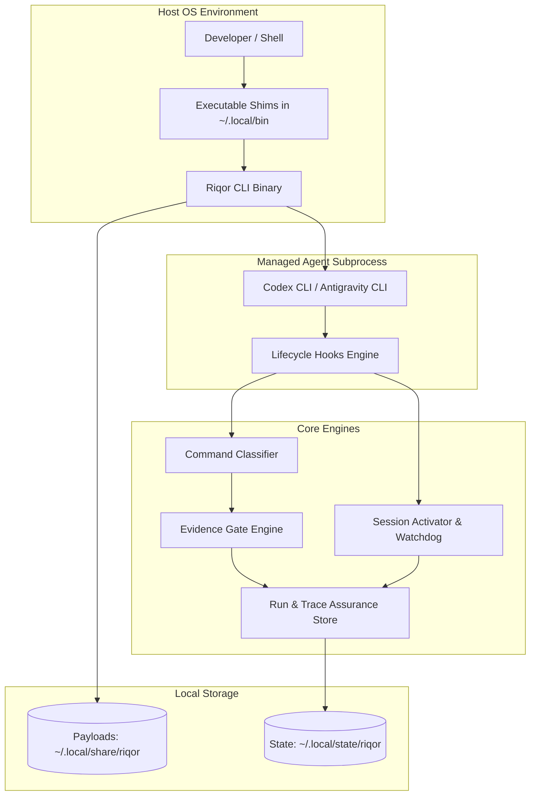

# Architecture Overview

This document provides a conceptual deep dive into Riqor's system architecture, process isolation boundaries, local execution design, and component interactions.

---

## High-Level System Architecture

Riqor is designed as a lightweight, non-daemon local governance layer around AI coding agents.



---

## Architectural Principles

### 1. No Background Daemons or Network Listeners
Riqor does not run background service daemons (`systemd`, `launchd`) or listen on network sockets (`localhost:8080`). All logic is executed inline when triggered by shell commands, child process lifecycle hooks, or CLI invocations.

### 2. Subprocess Execution & Argument Safety
When starting Codex (`riqor codex`) or Google Antigravity (`riqor agy`), Riqor spawns the target agent CLI as a direct child process using argument arrays with `shell: false`.

```text
[riqor CLI process]
       └── (execa / child_process.spawn with shell: false)
             └── [codex / agy child process]
```

This design guarantees that shell injection attacks cannot occur via argument parameters, while ensuring signal handling (`SIGINT`, `SIGTERM`) propagates cleanly to the child agent process.

### 3. Isolated State Storage
Local state is compartmentalized by repository identity. Each repository is mapped to a SHA-256 digest of its canonical root path, ensuring that state operations in one project never bleed into another.

---

## Component Deep Dive

### 1. Versioned Payload Installer
The installer copies runtime assets into versioned payload directories under `~/.local/share/riqor/<version>/` and maintains a `current` symlink. This guarantees atomic updates and simple rollback (`riqor uninstall`).

### 2. Shell Hooks Integration
Shell integration injects lightweight `preexec` and `postexec` hooks into `zsh` or `bash`. These hooks evaluate command signatures, compute command SHA-256 digests, classify operations into `mutation` or `verification`, and update the session's evidence status.

### 3. Session Activator & Watchdog
The activator uses lifecycle event hooks (`Stop` boundary) to trigger task reviews. To guarantee that the session cannot lock up, a watchdog timer monitors the review state and fails open if the review exceeds the configured threshold.

### 4. Assurance & Run Store
The assurance module manages repository run goals and writes ordered, append-only event streams (`events.jsonl`). It enforces exclusive file locking (`.lock`) to prevent race conditions during concurrent command executions.
