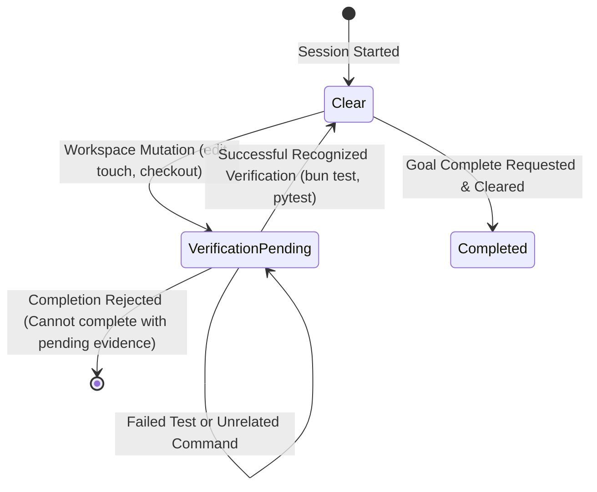

# Theoretical Foundation: Evidence Gate Lifecycle

This document explains the theory and design philosophy behind Riqor's **Evidence Gates** and empirical completion claims.

---

## The Problem: Premature Completion Claims

AI coding agents excel at writing code, but struggle with self-verification. LLM agents frequently:
- Claim a bug is fixed without running the test suite.
- Edit multiple source files and assume compilation succeeds.
- Hallucinate passing test results when commands were never executed.

In developer tooling, **unverified completion claims are product bugs**.

---

## Riqor's Evidence State Machine

To enforce empirical rigor, Riqor models the terminal session as a deterministic state machine:

---

## State Transition Rules

### 1. The Workspace Mutation Rule
Any terminal action or agent tool call that mutates workspace state (creating, editing, or deleting files) automatically transitions the evidence state to `verification-pending`.

### 2. The Empirical Verification Rule
State can transition from `verification-pending` back to `clear` **only** when a recognized verification command runs and exits with a status code of `0`.

- A failing verification run (`exit code != 0`) preserves `verification-pending`.
- A mutation-shaped command makes verification pending even when it exits nonzero, because an earlier operation in the command may already have changed the workspace.
- Executing non-verification commands (`ls`, `pwd`, `cat`) leaves state unchanged.

Package-manager scripts are recognized only when a verification word (`build`, `check`, `lint`, `test`, `typecheck`, or `validate`) is an exact colon, dash, or underscore-delimited part of the script name. An unrelated script such as `contest` is not verification evidence.
Compound commands that can mask a failing check, such as `bun test || true`, are not verification evidence either.

### 3. The Completion Assertion Rule
`riqor run complete` acts as a hard gate. If a developer or agent calls `riqor run complete` while the session is in `verification-pending`, the CLI rejects the command with exit code `1`.

---

## Why Evidence Gates Improve Agent Performance

By tying completion claims to observable evidence:
1. **Agent Behavior Shift**: Agents learn that completion commands will fail unless they run test suites first.
2. **Deterministic Auditability**: Maintainers can review `events.jsonl` to verify exactly which test runner cleared the evidence gate before a pull request was opened.
3. **Zero Hallucination Risk**: Statements like "All tests pass" are backed by verifiable SHA-256 command digests recorded in local state.
