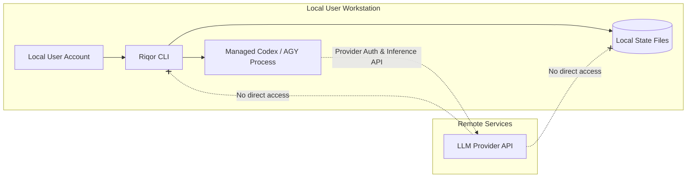

# Security & Trust Model

This document outlines Riqor's local security boundaries, protected data assets, data retention rules, and private vulnerability disclosure policy.

---

## Trust Boundaries

---

## Protected Data Assets & Zero Retention Policy

Riqor is designed with privacy-first data boundaries. It **never** stores:

- User prompts or LLM conversation transcripts
- Source code contents or raw file diffs
- Raw terminal command strings
- Standard output or standard error streams
- Environment variables or secrets (API keys, OAuth tokens)
- Raw canonical file system paths in stored run records

### What Riqor Stores Instead

To maintain verification auditability without exposing sensitive data, Riqor records:

- **Command SHA-256 Digests**: `hash(command_string)`
- **Repository Root Digest**: `hash(canonical_repo_path)`
- **Bounded Timestamps & Exit Codes**: Numerical execution metadata
- **Categorical State Flags**: `verification-pending` (Boolean)

---

## Subprocess Execution Safety

1. **No Shell Invocations**: Managed agent processes are launched using explicit argument arrays with `shell: false`, preventing shell command injection attacks.
2. **Environment Variable Sanitization**: Inherited activator tokens and sensitive execution flags are stripped from child process environments unless explicitly opted in via `--activator`.
3. **Restricted File Permissions**: All state directories created by Riqor enforce strict `0700` directory permissions and `0600` file permissions, restricting read/write access exclusively to the current OS user account.

---

## Integrity & Provenance Verification

Every Riqor binary release includes a signed `provenance.json` manifest listing exact SHA-256 hashes and byte sizes of all runtime files.

When `riqor doctor` executes:
1. It hashes every installed payload file.
2. It verifies hashes against `runtime/provenance.json`.
3. It inspects payload directories for unexpected or injected files.

If any discrepancy is found, `riqor doctor` fails and recommends a clean reinstallation.

---

## Vulnerability Reporting

If you discover a security vulnerability in Riqor, please **do not** open a public GitHub issue.

Report vulnerabilities securely via [GitHub Private Vulnerability Reporting](https://github.com/imMamdouhaboammar/riqor/security/advisories/new).
