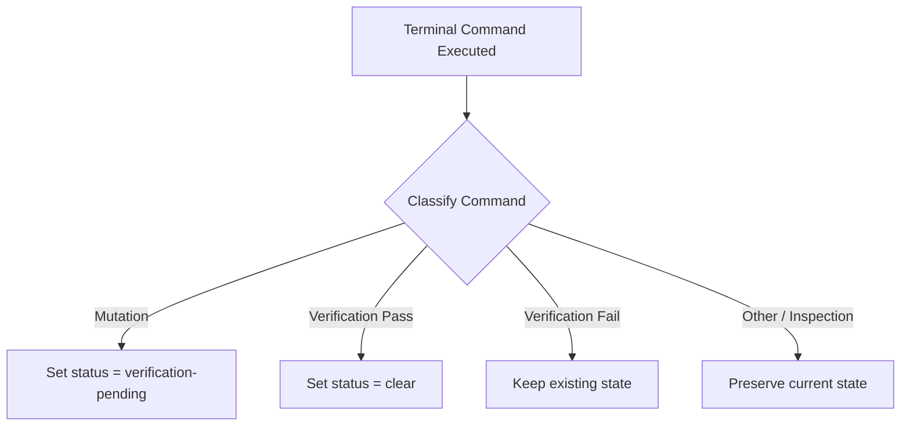

# How to Configure & Work with Evidence Gates

This guide explains how Riqor tracks workspace mutations, classifies terminal commands, and clears pending evidence using recognized verification runners.

---

## Workspace Mutation Tracking

Riqor uses local shell integration hooks (`preexec` and `postexec`) to monitor command executions in your terminal.



---

## Recognized Command Classifications

Commands are evaluated by Riqor's terminal classifier:

| Category | Example Commands | Resulting State |
| --- | --- | --- |
| **Workspace Mutation** | `git checkout`, `touch`, `edit`, `rm`, `bun build`, `mkdir` | Sets `verification-pending` |
| **Recognized Verification** | `bun test`, `npm test`, `pytest`, `cargo test`, `go test`, `git diff --check` | Clears `verification-pending` |
| **Agent / Shell Command** | `riqor doctor`, `codex`, `kaku`, `ls`, `pwd`, `cat` | State remains unchanged |

---

## Recognized Test Runners & Custom Scripts

Riqor recognizes standard test commands out-of-the-box across multiple language ecosystems:

- **JavaScript / TypeScript**: `bun test`, `npm test`, `pnpm test`, `yarn test`
- **Python**: `pytest`, `python -m pytest`
- **Rust**: `cargo test`
- **Go**: `go test`
- **C# / .NET**: `dotnet test`
- **Java / Kotlin**: `mvn test`, `./gradlew test`
- **Swift**: `swift test`
- **Linters & Verification**: `git diff --check`, `codex doctor`, `kaku doctor`

### Package Manager Script Matching
For Node.js / Bun projects, any script in `package.json` containing keywords such as `test`, `check`, `build`, `lint`, `typecheck`, or `validate` is automatically classified as a verification runner when executed via `npm run <script>` or `bun run <script>`.

---

## Inspecting Verification State

You can query the evidence status at any time:

### Text Output
```bash
riqor terminal status
```
Returns `clear` or `verification-pending`.

### JSON Output
```bash
riqor terminal status --json
```

Sample output:
```json
{
  "session": "tty-pty0",
  "evidencePending": true,
  "lastMutation": "2026-08-09T11:00:00.000Z",
  "lastVerification": null
}
```

---

## Manual Evidence Overrides

In cases where custom verification scripts cannot be automatically recognized by shell hooks, you can manually append a verification record to the local evidence ledger:

```bash
riqor evidence add verification "Custom integration tests executed successfully" --json
```
